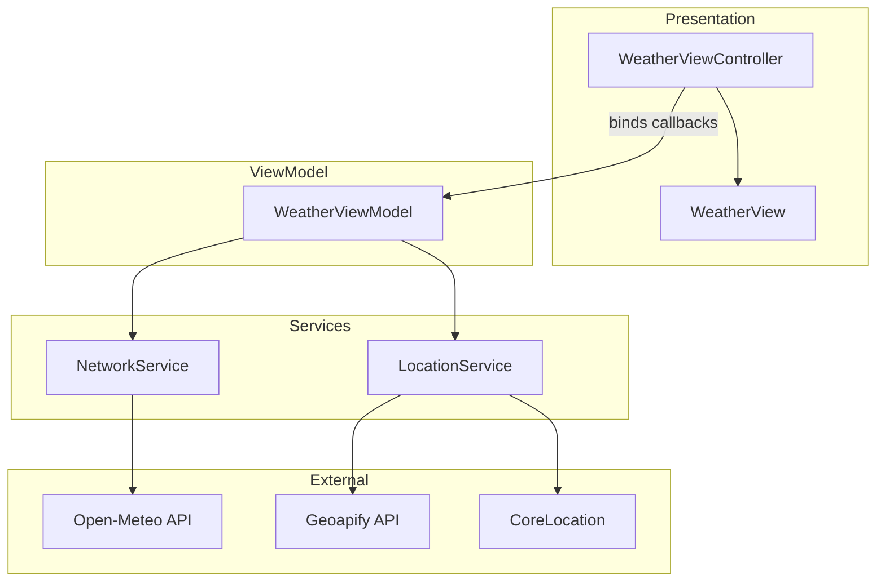

# WeatherAppMVVM

An iOS weather application built with **UIKit** and the **MVVM** pattern.  
Displays current conditions, hourly and daily forecasts, supports city search and current-location lookup.

---

## Overview

| | |
|---|---|
| **Platform** | iOS 26.2+ |
| **Language** | Swift 5 |
| **UI** | UIKit (programmatic, no Storyboards for main screen) |
| **Architecture** | MVVM + Service layer |
| **Concurrency** | Swift Concurrency (`async`/`await`, `Task`) |
| **Networking** | `URLSession` |
| **Localization** | English, Ukrainian |

### Features

- Current weather: temperature, wind, WMO weather code → localized description + SF Symbol icon
- Hourly forecast (collection view)
- 7-day daily forecast (table view)
- City search with autocomplete (Geoapify)
- Current location via `CoreLocation` (fallback to Kyiv if denied/unavailable)
- Inline error banner with user-friendly messages
- Unit tests with JSON fixtures

---

## Architecture

The app separates UI, presentation logic, and data access. Dependencies are injected through protocols, which keeps services testable and swappable.



**Data flow**

1. `WeatherViewController` binds to `WeatherViewModel` callbacks (`onWeatherLoaded`, `onCityFound`, `onError`).
2. `WeatherViewModel` orchestrates `LocationService` (coordinates / city name) and `NetworkService` (weather payload).
3. Raw API responses are decoded into DTOs (`OpenMeteoResponse`, `GeoCodeAPIResponse`), then mapped to domain models (`Weather`, `DailyForecast`, `HourlyForecast`).
4. `WeatherService` maps WMO weather codes to localization keys and SF Symbols.

---

## Project Structure

```
WeatherAppMVVM/
├── Application/          # AppDelegate, SceneDelegate
├── Config/               # xcconfig secrets, AppConfig
├── Controllers/          # WeatherViewController
├── ViewModels/           # WeatherViewModel
├── Views/                # WeatherView + reusable cells/banners
├── Models/               # Domain & API response models
├── Services/             # NetworkService, LocationService, WeatherService, ErrorCatch
├── Protocols/            # NetworkServiceProtocol, LocationServiceProtocol
├── Resources/            # Assets, Info.plist, Localizable.strings (en, uk)
└── WeatherAppMVVMTests/  # Unit tests + JSON fixtures
```

---

## External APIs

| Service | Purpose | Auth |
|---|---|---|
| [Open-Meteo](https://open-meteo.com/) | Weather forecast (current, hourly, daily) | Not required |
| [Geoapify](https://www.geoapify.com/) | City autocomplete & reverse geocoding | API key required |

API keys are **not** hardcoded in source. They are loaded from `Config.xcconfig` → `Info.plist` → `AppConfig`.

---

## Getting Started

### Requirements

- macOS with **Xcode**
- iOS **26.2+** simulator or device
- Free [Geoapify](https://www.geoapify.com/) API key

### 1. Clone

```bash
git clone <repository-url>
cd WeatherAppMVVM
```

### 2. Configure API key

Copy the example config and add your key:

```bash
cp WeatherAppMVVM/Config/Config.example.xcconfig \
   WeatherAppMVVM/Config/Config.xcconfig
```

Edit `WeatherAppMVVM/Config/Config.xcconfig`:

```xcconfig
GEOAPIFY_API_KEY = your_api_key_here
```

> `Config.xcconfig` is listed in `.gitignore` and must not be committed.

### 3. Run

1. Open `WeatherAppMVVM.xcodeproj` in Xcode.
2. Select the **WeatherAppMVVM** scheme.
3. Choose a simulator or a connected device.
4. Press **Run** (`⌘R`).
5. Allow location access when prompted.

---

## Testing

Run all tests in Xcode: **Product → Test** (`⌘U`).

| Test target | What it covers |
|---|---|
| `NetworkServiceTests` | Open-Meteo JSON decoding, URL construction |
| `LocationServiceTests` | Geoapify JSON decoding, URL encoding (spaces, Unicode) |

Fixtures live in `WeatherAppMVVMTests/Fixtures/`.  
Network calls are not hit during unit tests — responses are loaded from bundled JSON.

---

## Error Handling

`ErrorCatch` is a typed `LocalizedError` enum used by `NetworkService`:

- Invalid URL / response
- HTTP status codes (400, 401, 403, 404, 5xx) with user-facing messages
- Decoding failures

Errors propagate to the ViewModel and are shown in `ErrorBanner` on the main screen.

---

## Localization

Strings are stored in:

- `Resources/en.lproj/Localizable.strings`
- `Resources/uk.lproj/Localizable.strings`

Weather descriptions use WMO code → localization key mapping in `WeatherService`.

---

## Notes for Reviewers

- **MVVM without Combine/Rx**: ViewModel exposes closure callbacks instead of `@Published` / reactive bindings.
- **Protocol-based DI**: Default service implementations are injected via initializer defaults — easy to mock in tests.
- **No third-party dependencies**: Pure Apple frameworks (`UIKit`, `Foundation`, `CoreLocation`, `MapKit`).
- **Secrets management**: `.xcconfig` + `.gitignore` pattern keeps API keys out of version control.
